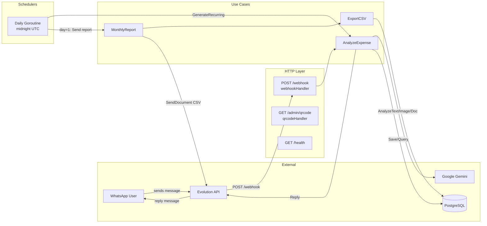
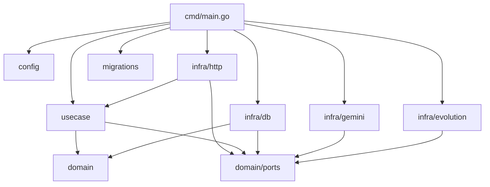
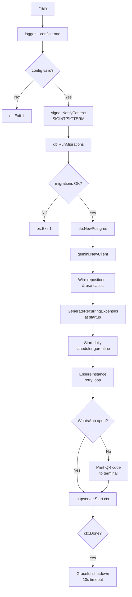
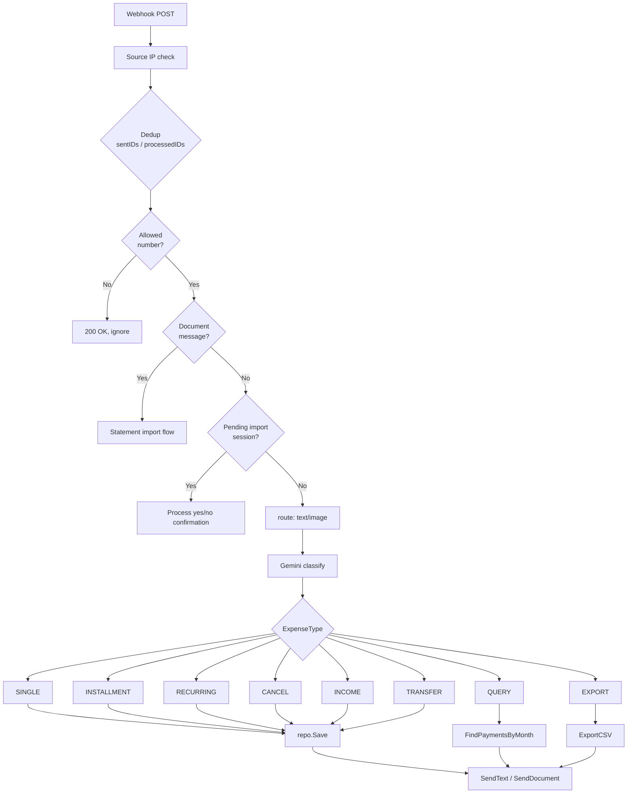

# System Design & Architecture

## Architecture Overview

Go monolith wired in `cmd/main.go`. All external I/O is behind interfaces defined in `internal/domain/ports/`. Business rules live in `internal/usecase/`. Infrastructure adapters live in `internal/infra/`.



### Technology stack

| Layer | Technology |
|---|---|
| Language | Go 1.23+ |
| WhatsApp gateway | Evolution API (self-hosted) |
| AI classification | Google Gemini (`gemini-2.5-flash-lite`) |
| Database | PostgreSQL via `pgx/v5` connection pool |
| Migrations | `pressly/goose` with embedded SQL files |
| Containerisation | Docker / Docker Compose |

---

## Data Models

### `purchases` table

| Column | Type | Notes |
|---|---|---|
| `id` | UUID | PK, `gen_random_uuid()` |
| `description` | TEXT | Nullable |
| `category` | TEXT | `FOOD`, `TRANSPORT`, `HEALTH`, `ENTERTAINMENT`, `SHOPPING`, `MARKET`, `INVESTMENT`, `SALARY`, `OTHER` |
| `payment_method` | TEXT | `CASH`, `CREDIT_CARD`, `DEBIT_CARD`, `PIX`, `OTHER` |
| `kind` | TEXT | `EXPENSE`, `INCOME`, `TRANSFER` |
| `transfer_direction` | TEXT | `IN` (redemption) or `OUT` (application); nullable for non-transfers |
| `type` | TEXT | `SINGLE`, `INSTALLMENT`, `RECURRING` |
| `total_amount` | DECIMAL(12,2) | > 0 |
| `installment_count` | INT | Nullable; only for INSTALLMENT |
| `installment_amount` | DECIMAL(12,2) | Nullable; only for INSTALLMENT |
| `day_of_month` | INT | Nullable; only for RECURRING (1–31) |
| `is_active` | BOOLEAN | False when cancelled |
| `cancelled_at` | TIMESTAMPTZ | Nullable |
| `cancellation_reason` | TEXT | Nullable |
| `raw_input` | TEXT | Original user message / import tag |
| `created_at` | TIMESTAMPTZ | Auto |

**Constraints**: `kind != 'INCOME'` and `kind != 'TRANSFER'` cannot have `type = 'INSTALLMENT'`.

### `payments` table

| Column | Type | Notes |
|---|---|---|
| `id` | UUID | PK |
| `purchase_id` | UUID | FK → `purchases.id` ON DELETE CASCADE |
| `amount` | DECIMAL(12,2) | > 0 |
| `status` | TEXT | `PENDING`, `PAID`, `CANCELLED` |
| `installment_number` | INT | Nullable |
| `due_date` | DATE | Nullable |
| `reference_month` | DATE | Nullable; first day of billing month (RECURRING) |
| `paid_at` | TIMESTAMPTZ | Nullable |
| `created_at` | TIMESTAMPTZ | Auto |

---

## API Design

### External — Evolution API webhooks

Evolution sends `POST /webhook` with JSON:
```json
{
  "event": "messages.upsert",
  "instance": "<name>",
  "data": {
    "key": { "remoteJid": "...", "fromMe": false, "id": "..." },
    "message": {
      "conversation": "...",
      "imageMessage": { "mimetype": "...", "caption": "..." },
      "documentMessage": { "mimetype": "...", "caption": "...", "fileName": "..." },
      "extendedTextMessage": { "text": "..." }
    },
    "base64": "<optional base64 media>"
  }
}
```

### Internal HTTP routes

| Method | Path | Auth | Purpose |
|---|---|---|---|
| `POST` | `/webhook` | Source IP | Receives WhatsApp messages |
| `GET` | `/admin/qrcode` | Bearer `ADMIN_SECRET` | WhatsApp QR code / connection status |
| `GET` | `/health` | None | Liveness check |

### Domain ports (Go interfaces)

```go
// internal/domain/ports/ai_analyzer.go
type AIAnalyzer interface {
    AnalyzeText(ctx, text) (*ExpenseAnalysis, error)
    AnalyzeImage(ctx, imageData []byte, mimeType string) (*ExpenseAnalysis, error)
    AnalyzeDocument(ctx, data []byte, mimeType string) (*StatementAnalysis, error)
}

// internal/domain/ports/messenger.go
type Messenger interface {
    SendText(ctx, to, text string) (messageID string, error)
    SendDocument(ctx, to, filename, base64Data, caption string) (messageID string, error)
    FetchImageBase64(ctx, remoteJid string, fromMe bool, messageID string) (string, error)
}

// internal/domain/ports/purchase_repository.go
type PurchaseRepository interface {
    Save(ctx, *Purchase, []Payment) error
    Update(ctx, *Purchase) error
    FindActiveRecurring(ctx) ([]Purchase, error)
    FindByDescription(ctx, description string) ([]Purchase, error)
    SavePayment(ctx, *Payment) error
    HasPaymentForMonth(ctx, purchaseID, month) (bool, error)
    FindPaymentsByMonth(ctx, month) ([]PaymentSummary, error)
    FindPaymentDetailsByMonth(ctx, month) ([]PaymentDetail, error)
    FindIncomeTotalByMonth(ctx, month) (float64, error)
    FindTransferNetByMonth(ctx, month) (applied, redeemed float64, error)
    ExistsPaymentByDateAndAmount(ctx, date, amount) (bool, error)
}
```

---

## Component Breakdown



### Startup sequence



### Message routing flow



---

## Design Decisions

| Decision | Rationale |
|---|---|
| Monolith over microservices | Single owner, low traffic; simplicity wins over distributed complexity |
| Ports & adapters | Keeps AI/DB/WhatsApp adapters swappable; use-cases are testable without external dependencies |
| In-memory deduplication | Low-volume assistant; Redis dependency removed to simplify deployment |
| `sync.Map` for pending sessions | No persistence needed; 30-min TTL sufficient for a single-owner flow |
| Gemini `gemini-2.5-flash-lite` | Balance of cost, speed, and Portuguese comprehension |
| `pgx/v5` directly (no ORM) | Explicit SQL is easier to audit and tune; schema is simple enough |
| Goose embedded migrations | Schema bundled with the binary; no separate migration binary needed |
| DNS-based webhook source check | Avoids exposing a shared secret in Evolution's webhook config |

---

## Non-Functional Requirements

| Requirement | Target |
|---|---|
| Startup time | < 5 s (excluding Evolution API polling) |
| Graceful shutdown | 10-second drain window |
| Webhook body size limit | 10 MiB |
| Admin rate limit | 10 req/min per IP |
| DB pool size | Min 2, max 10 connections |
| Scheduler precision | ± 1 minute (midnight UTC) |
| Security | Allowlist by JID; source IP validation; bearer token for admin; no credentials logged |

