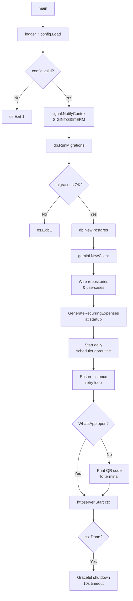
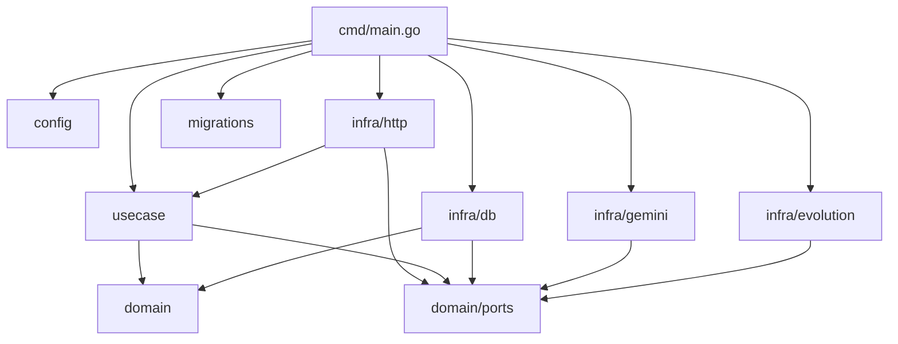

# Knowledge: Main Flow (`cmd/main.go`)

## Overview

**Language:** Go  
**Entry Point:** `cmd/main.go` — `func main()`  
**Purpose:** Bootstraps and wires the entire application: loads configuration, runs database migrations, initialises all infrastructure adapters, starts background schedulers, establishes the WhatsApp connection via Evolution API, and finally launches the HTTP server — all within a graceful-shutdown context.

The application is a Go monolith that acts as a WhatsApp-based personal finance assistant. Users send messages (text, images, documents) to a WhatsApp number; the webhook receives them, classifies intent via Gemini AI, persists purchases/payments in PostgreSQL, and replies with confirmations or reports.

---

## Implementation Details

### 1. Startup Sequence

```
main()
 ├─ 1. logger        — slog JSON handler → os.Stdout
 ├─ 2. config.Load() — validates required env vars, fails fast with joined errors
 ├─ 3. signal ctx    — SIGINT/SIGTERM trigger graceful shutdown
 ├─ 4. db.RunMigrations() — goose Up via embedded FS (blocking)
 ├─ 5. db.NewPostgres()   — pgxpool connection
 ├─ 6. gemini.NewClient() — Gemini AI client
 ├─ 7. Use-case wiring
 │    ├─ db.NewPurchaseRepository(postgresDB)
 │    ├─ usecase.NewAnalyzeExpense(repo, gemini, logger)
 │    ├─ usecase.NewExportCSV(repo)
 │    └─ usecase.NewMonthlyReport(exportCSV, evolutionClient, ownerPhone, logger)
 ├─ 8. GenerateRecurringExpenses() — sync call at startup
 ├─ 9. Daily scheduler goroutine (midnight UTC tick)
 ├─ 10. EnsureInstance() retry loop — waits for Evolution API
 ├─ 11. QR code display (if WhatsApp not yet connected)
 └─ 12. httpserver.NewServer(...).Start(ctx) — blocking until shutdown
```

### 2. Configuration (`internal/config/config.go`)

`config.Load()` reads from `.env` via `godotenv`, then OS env vars. All validation errors are accumulated and returned as a single joined error. Required variables:

| Variable | Purpose |
|---|---|
| `DATABASE_URL` | PostgreSQL DSN |
| `GEMINI_API_KEY` | Google Gemini AI key |
| `EVOLUTION_INSTANCE` | WhatsApp instance identifier |
| `EVOLUTION_API_KEY` | Evolution API auth key |
| `OWNER_PHONE` | Owner's WhatsApp number (auto-added to allowed list) |
| `PORT` | HTTP server port (default: `8080`) |
| `ALLOWED_NUMBERS` | Comma-separated list of permitted senders |
| `ADMIN_SECRET` | Secret for `/admin/qrcode` endpoint |

### 3. Database Migrations

`db.RunMigrations` opens a temporary `database/sql` connection (pgx driver), creates a goose provider backed by the embedded `migrations.FS`, and runs all pending `Up` migrations before the pgxpool is opened. This guarantees schema readiness before any use-case code runs.

Migrations reside in `migrations/` and are embedded at build time.

### 4. Daily Scheduler Goroutine

A goroutine sleeps until midnight UTC each day using `time.After(time.Until(next))` and then:

1. Calls `analyzeExpense.GenerateRecurringExpenses(ctx)` — creates payment records for active recurring purchases.
2. On the 1st of each month, calls `monthlyReport.Send(ctx)` — exports previous month's CSV and sends it via WhatsApp to the owner.

The goroutine exits when `ctx.Done()` fires (shutdown signal).

### 5. WhatsApp Connection Bootstrapping

Before starting the HTTP server, the application:

1. **Polls `EnsureInstance`** in a 5-second retry loop until the Evolution API instance is available.
2. **Fetches connection state** — if not `"open"`, retrieves a QR code and renders it in the terminal with `qrterminal`.
3. Waits 2 seconds after instance confirmation before proceeding (allows Evolution to stabilise).

### 6. HTTP Server (`internal/infra/http/server.go`)

`httpserver.NewServer` wires three routes:

| Route | Handler | Middleware |
|---|---|---|
| `POST /webhook` | `webhookHandler.Handle` | `webhookSourceMiddleware` (validates `Host` against Evolution origin) |
| `GET /admin/qrcode` | `qrcodeHandler.Handle` | `adminRateLimitMiddleware` (IP rate limiter: 10 req/min) |
| `GET /health` | inline 200 OK | — |

`server.Start(ctx)` is **blocking**. It listens for connections and performs a 10-second graceful shutdown when `ctx` is cancelled. It also launches `handler.startCleanup(ctx)` as a goroutine that prunes expired in-memory state (deduplication maps, pending import sessions) every hour.

### 7. Webhook Handler (`internal/infra/http/webhook_handler.go`)

Holds:
- `analyzeExpense usecase.ExpenseAnalyzer` — classifies and persists expenses
- `csvExporter usecase.CSVExporter` — on-demand CSV export
- `messenger ports.Messenger` — sends WhatsApp replies
- `sentIDs / processedIDs sync.Map` — message deduplication (TTL 1 hour)
- `pendingImports sync.Map` — multi-step import sessions (TTL 30 min)

Allowed senders = `AllowedNumbers` union `{ownerPhone}`.

---

## Dependencies

### Depth-1 (direct from `cmd/main.go`)

| Package | Role |
|---|---|
| `internal/config` | Environment-based configuration loading |
| `internal/infra/db` | PostgreSQL pool + migrations runner + repository |
| `internal/infra/gemini` | Gemini AI client (implements `ports.AIAnalyzer`) |
| `internal/infra/evolution` | Evolution API client (implements `ports.Messenger` + WhatsApp management) |
| `internal/infra/http` | HTTP server, routes, middleware, handlers |
| `internal/usecase` | Business logic use cases |
| `migrations` | Embedded SQL migration files |

### Depth-2 (key internal dependencies)

| Component | Depends On |
|---|---|
| `usecase.AnalyzeExpense` | `ports.PurchaseRepository`, `ports.AIAnalyzer`, `slog.Logger` |
| `usecase.ExportCSV` | `ports.PurchaseRepository` |
| `usecase.MonthlyReport` | `usecase.CSVExporter`, `ports.Messenger` |
| `httpserver.Server` | `usecase.ExpenseAnalyzer`, `usecase.CSVExporter`, `ports.Messenger`, `QRProvider` |

### Depth-3 (external packages)

| Package | Purpose |
|---|---|
| `github.com/jackc/pgx/v5` | PostgreSQL driver and connection pool |
| `github.com/pressly/goose/v3` | Schema migration runner |
| `google.golang.org/genai` (Gemini SDK) | AI text/image/document analysis |
| `github.com/mdp/qrterminal/v3` | Terminal QR code rendering |
| `github.com/joho/godotenv` | `.env` file loader |

---

## Visual Diagrams

### Startup Flow



### Runtime Architecture

```mermaid
graph LR
    subgraph External
        WA[WhatsApp User]
        EVOL[Evolution API]
        GEMINI[Google Gemini]
        PG[(PostgreSQL)]
    end

    subgraph HTTP Layer
        WH[/webhook\nwebhookHandler]
        QR[/admin/qrcode\nqrcodeHandler]
        HE[/health]
    end

    subgraph Use Cases
        AE[AnalyzeExpense]
        CSV[ExportCSV]
        MR[MonthlyReport]
    end

    subgraph Schedulers
        DS[Daily Goroutine\nmidnight UTC]
    end

    WA -->|sends message| EVOL
    EVOL -->|POST /webhook| WH
    WH --> AE
    AE -->|AnalyzeText/Image/Doc| GEMINI
    AE -->|Save/Query| PG
    AE -->|Reply| EVOL
    EVOL -->|reply message| WA
    DS -->|GenerateRecurring| AE
    DS -->|day=1: Send report| MR
    MR --> CSV
    CSV --> PG
    MR -->|SendDocument CSV| EVOL
```

### Dependency Graph



---

## Additional Insights

### Error Handling Strategy

- **Startup errors** (config, migrations, DB, Gemini init) are fatal — `os.Exit(1)`.
- **Evolution API unavailability** is non-fatal at startup; the app polls every 5 seconds and respects `ctx.Done()` for clean exit.
- **WhatsApp QR/state errors** are logged as warnings; the app proceeds without blocking startup.
- **Scheduler errors** (recurring generation, monthly report) are logged and skipped; the scheduler continues.
- **Shutdown** is cooperative: `context.WithTimeout(10s)` gives active HTTP requests time to drain.

### Concurrency Model

- One goroutine: daily scheduler (exits on ctx cancel).
- One goroutine: `startCleanup` in webhook handler (hourly pruning of `sync.Map` entries).
- HTTP handler goroutines: managed by `net/http` standard library.
- No worker pools or explicit concurrency primitives beyond `sync.Map`.

### Security Considerations

- **Webhook source validation**: `webhookSourceMiddleware` checks the `Host` header against the configured Evolution API host, preventing spoofed webhook deliveries.
- **Allowed-number allowlist**: only `ownerPhone` and explicitly configured numbers may interact with the bot.
- **Admin rate limiter**: `/admin/qrcode` is protected by IP-based rate limiting (10 req/min) + `AdminSecret`.
- **Body size limit**: webhook bodies capped at 10 MiB (`io.LimitReader`).
- **No credentials logged**: configuration values are not emitted to logs.

### Potential Improvements / Risks

| Risk | Notes |
|---|---|
| `time.Sleep(2 * time.Second)` after `EnsureInstance` | Magic delay; could be replaced by polling connection state. |
| Midnight scheduler uses `now.Day()+1` | Does not account for month-end rollover correctly for months < 31 days (e.g., Feb 28+1=29 may wrap). Use `time.Date` with month increment instead. |
| No retry on `GenerateRecurringExpenses` failure | Silent skip; recurring payments may be missed if DB is temporarily unavailable at midnight. |
| In-memory deduplication maps | Lost on restart; duplicate message processing is possible within a brief restart window. |

---

## Metadata

| Field | Value |
|---|---|
| Analysis Date | 2026-05-05 |
| Entry Point | `cmd/main.go` — `func main()` |
| Analysis Depth | 3 |
| Files Touched | `cmd/main.go`, `internal/config/config.go`, `internal/infra/db/migrate.go`, `internal/infra/db/postgres.go`, `internal/infra/http/server.go`, `internal/infra/http/webhook_handler.go`, `internal/infra/evolution/client.go`, `internal/infra/gemini/client.go`, `internal/usecase/analyze_expense.go`, `internal/usecase/monthly_report.go`, `internal/domain/ports/*.go` |
| Language | Go |
| Architecture | Monolith |

---

## Next Steps

- Run `/capture-knowledge` on `webhook_handler.Handle` to document the full WhatsApp message routing and expense classification flow.
- Run `/capture-knowledge` on `usecase.AnalyzeExpense` to map all expense types (SINGLE, INSTALLMENT, RECURRING, TRANSFER, INCOME, QUERY, EXPORT_CSV).
- Investigate and fix the midnight scheduler day-rollover issue noted above.
- Consider replacing the `time.Sleep(2s)` with a state-poll loop for more robust Evolution API connection handling.
- Commit this file: `git add docs/ai/implementation/knowledge-main-flow.md`.
